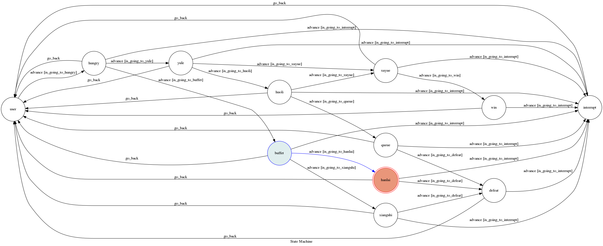

# 小海豹模擬器

你是一隻無所事事的小海豹，整天過著悠哉悠哉的生活，但是你沒有發現的是，隱藏在平靜生活下的一場巨大危機，正悄悄的向你靠近...

## Setup

### Prerequisite
* Python 3.6
* Line Page and App
* HTTPS Server

#### Install Dependency

* pygraphviz (For visualizing Finite State Machine)
    * [Setup pygraphviz on Ubuntu](http://www.jianshu.com/p/a3da7ecc5303)
	* [Note: macOS Install error](https://github.com/pygraphviz/pygraphviz/issues/100)

## Finite State Machine

## Usage
The initial state is set to `user`.

Every time `user` state is triggered to `advance` to another state, it will `go_back` to `user` state after the bot replies corresponding message.

* user
	* Input: "從頭開始"
		* State: "hungry"
		* Reply: "緊急特豹"
		* Reply: "你是一隻小海豹，月底，飢腸轆轆的你不得不去覓食，但此時你只有65元..."
		* Reply: 兩個按鈕 1.育樂街將就一下吧 2.高級自助餐!!!
		
			* Input: "育樂街將就一下吧"
				* State: "yule"
				* Reply: "性命攸關"
				* Reply: "此刻一個關係到你未來的抉擇擺在你面前----吃啥..."
				* Reply: 兩個按鈕 1.我大煦悅 2.活力小廚
				
					* Input: "我大煦悅"
						* State: "xuyue"
						* Reply: "尊榮獨享"
						* Reply: "經過重重難關，你終於成功了--煦悅的美味焢肉飯，還有喝不完的綠豆湯..."
						* Reply: 一個按鈕 1. "暴飲暴食"	
						
							* Input: "暴飲暴食"
								* State: "win"
								* Reply: "功成身退"
								* Reply: "酒足飯飽過後，你充實而欣慰，有錢人的快樂，就是這麼樸實無華，且枯燥..."
								* Reply: 一個按鈕 1. "從頭開始"	(回到user state)
								
					* Input: "活力小廚"
						* State: "huoli"
						* Reply: "生死交關"
						* Reply: "此時，一件意想不到的事發生了，大概有八百人在排隊!!!此時你應該..."
						* Reply: 兩個按鈕 1.我大煦悅(advance to xuyue state) 2.堅持到底
						
							* Input: "堅持到底"
								* State: "queue"
								* Reply: "白駒過隙"
								* Reply: "\"我可以慢慢等...\"但是人實在太多了，直到關門你都沒能買到便當..."
								* Reply: 一個按鈕 1. "一敗塗地"	
										
									
									* Input: "一敗塗地"
										* State: "defeat"
										* Reply: "時光倒流"
										* Reply: "你拿起街邊的破碗，本來準備要就地行乞，突然眼前出現了月光寶盒..."
										* Reply: 一個按鈕 1. "從頭開始"	 (回到user state)
						
			* Input: "高級自助餐!!!"
				* State: "buffet"
				* Reply: "世紀難題"
				* Reply: "以本公子的身分，當然是吃高級Buffet了，不過今天要吃哪一間呢..."
				* Reply: 兩個按鈕 1.饗食天堂 2.漢來海港

					* Input: "饗食天堂"
						* State: "xiangshi"
						* Reply: "身無長物"
						* Reply: "就說你只有65塊了..."
						* Reply: 一個按鈕 1. "一敗塗地"	(advance to defeat state)

					* Input: "漢來海港"
						* State: "hanlai"
						* Reply: "身無長物"
						* Reply: "就說你只有65塊了..."
						* Reply: 一個按鈕 1. "一敗塗地"	(advance to defeat state)
					(雖然這兩個state的Reply都一樣 但是其實是兩個不同state喔❤️❤️❤️)

	* Input: "誰"
		* State: "interrupt"
		* Reply: "風雲變色"
		* Reply: "一道閃電砸下，讓眼前的一切都灰飛煙滅，一切回到從前..."
		* Reply: 一個按鈕 1.從頭開始(回到user state)
		(此state用於離開當前環節 重新開始)

